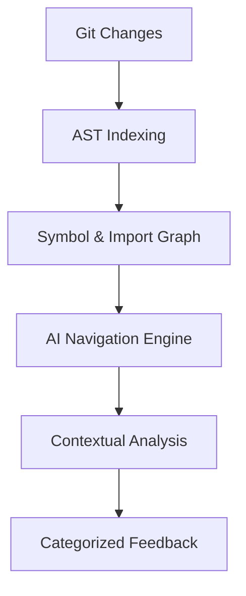

# CodeReviewer

AI-powered code review tool that uses intelligent navigation to analyze only relevant code, reducing costs by 90% while providing deeper insights than traditional full-context approaches.

## Quick Start

```bash
git clone https://github.com/jackyshang/AICodeReviewer.git
cd AICodeReviewer
pip install -e .
export GEMINI_API_KEY="your-api-key-here"
reviewer
```

## Key Benefits

### 🧠 **Intelligent Code Navigation**
Unlike tools that dump entire codebases to AI (hitting token limits and wasting money), CodeReviewer uses AST-based indexing and dependency graph traversal:
- **Precision**: Only reads files actually related to your changes
- **Scalability**: Works on 10-file or 10,000-file projects equally well
- **Cost Efficiency**: 90% token reduction compared to traditional approaches

### 📊 **Performance Benefits**
- **90% cost reduction** compared to full-context approaches
- **10x faster** analysis through intelligent navigation
- **Unlimited scalability** - works on any codebase size

### 🔄 **Session Persistence with Memory**
- Maintains full conversation context across multiple review iterations
- AI remembers previous issues, discussions, and decisions
- Perfect for iterative development workflows
- Reduces redundant explanations and improves feedback quality

### 🎯 **Advanced Review Modes**
- **Critical Mode**: Only must-fix issues (security, bugs, breaking changes)
- **AI-Generated Mode**: Detects hallucinations, incomplete implementations, non-existent imports
- **Prototype Mode**: Focuses on functionality, deprioritizes security for rapid iteration
- **Full Mode**: Comprehensive feedback including style and optimization suggestions

## Architecture

CodeReviewer uses a three-stage intelligent navigation approach:



### Stage 1: Pre-Analysis Indexing
```python
# Fast AST-based code structure analysis
CodebaseIndex:
├── SymbolMap: {class/function → file:line}
├── ImportGraph: {file → dependencies}
├── TestMapping: {test → source_file}
└── FileTree: Hierarchical structure
```

### Stage 2: Intelligent Navigation
The AI receives navigation tools instead of raw code:
- `read_file(path)` - On-demand file access
- `search_symbol(name)` - Find definitions
- `find_usages(symbol)` - Locate dependencies  
- `follow_imports(file)` - Trace relationships

### Stage 3: Contextual Review
AI builds understanding incrementally:
```
Changed: auth.py → Reads file → Finds login() changes
↓
Searches: login usages → Discovers API endpoint calls
↓
Reads: api/endpoints.py → Identifies missing exception handling
↓
Result: Comprehensive cross-file impact analysis
```

## Real-World Impact

**Scenario**: Authentication system change in large codebase

**Traditional Approach**: Sends entire codebase → hits token limits → incomplete analysis
**CodeReviewer**: Navigates intelligently → reads only 8 relevant files → finds critical cross-file bugs

**Result**: 90% cost reduction while providing deeper, more accurate insights


## Configuration

Create `.reviewer.yaml` in your project root:

```yaml
review:
  provider: gemini-2.5-pro
  mode: critical  # critical, full, ai-generated, prototype
  
gemini_settings:
  api_key_env: GEMINI_API_KEY
  rate_limiting:
    enabled: true
    tier: tier1  # Free tier limits
    
output:
  format: markdown
  show_navigation_path: true
```


## Advanced Features

### 🔧 **Intelligent Review Modes**

```bash
# Critical-only analysis (production-ready focus)
reviewer --mode critical
# → Security vulnerabilities, breaking changes, bugs

# AI-generated code detection
reviewer --ai-generated  
# → Hallucinated imports, incomplete functions, TODO stubs

# Prototype mode (speed over perfection)
reviewer --prototype
# → Functional issues only, skip security for rapid iteration

# Comprehensive analysis
reviewer --mode full
# → Everything: bugs, style, performance, architecture
```

### 💾 **Session Persistence & Context Memory**

```bash
# Start persistent session (remembers conversation)
reviewer --session-name auth-refactor

# Continue session days later - AI remembers:
# - Previous issues discussed
# - Your coding preferences  
# - Architecture decisions made
# - Outstanding technical debt
reviewer --session-name auth-refactor

# Session management
reviewer --list-sessions
reviewer --service status  # Background service health
```

**Session Benefits**:
- **Contextual Continuity**: No repeated explanations of project structure
- **Progressive Refinement**: AI learns your codebase patterns over time
- **Decision Memory**: Recalls why certain architectural choices were made
- **Issue Tracking**: Remembers which problems were already addressed

### ⚡ **Performance & Rate Limiting**

**Built-in Rate Limiting** (Gemini API Tier 1):
```yaml
# Automatic compliance with API limits
gemini_settings:
  rate_limiting:
    enabled: true
    tier: tier1
    # Pro: 150 req/min, Flash: 1000 req/min
```

**Efficiency**: 90% fewer tokens than traditional approaches

```bash
# Monitor performance
reviewer --verbose  # Show navigation path and token usage
reviewer --output-format markdown --show-stats
```


## 🔌 MCP Integration (Claude Desktop)

**Model Context Protocol** integration enables seamless code reviews within Claude Desktop:

```json
{
  "mcpServers": {
    "reviewer": {
      "command": "reviewer-mcp"
    }
  }
}
```

**Benefits of MCP Integration**:
- **Native Claude Access**: Use code review tools directly in Claude conversations  
- **Unified Workflow**: No context switching between tools
- **Rich Interaction**: Claude can ask follow-up questions about findings
- **Combined Analysis**: Leverage both CodeReviewer's navigation + Claude's reasoning

**Available MCP Tools**:
- `review_changes` - Full code review with intelligent navigation
- `list_review_sessions` - Session management
- `manage_review_service` - Service control and logs

## Technical Requirements

- **Python**: 3.8+ (AST parsing, async support)
- **Git**: Repository with uncommitted changes
- **API Access**: Gemini API key ([Free tier available](https://makersuite.google.com/app/apikey))
- **Memory**: ~50MB for codebase indexing
- **Disk**: Minimal (indexes cached in memory)

**Supported Languages** (via AST parsing):
- Python, JavaScript/TypeScript, Java, Go, C#, PHP, Ruby
- Extensible architecture for additional language support

## Contributing

See [CONTRIBUTING.md](CONTRIBUTING.md) for development setup and guidelines.

## License

MIT License - see [LICENSE](LICENSE) file for details.
